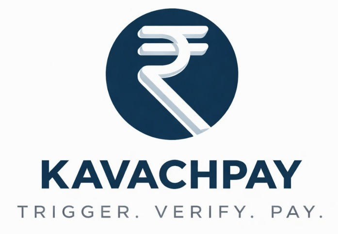

 

# When the city stops, your income doesn't.

 

 

### India's First Parametric Income Insurance for Gig Delivery Workers

*Trigger · Verify · Pay*

 

| 50M+ | ₹39/week | 15 Events | < 2 min | 20 Cities | 3 Languages |
|:---:|:---:|:---:|:---:|:---:|:---:|
| Gig workers in India | Starting premium | Disruption types covered | Avg payout time | Covered | EN · हिं · தமிழ் |

 

**Built by:** Ankith · Ashwin · Madhav · Kirithic  
Shiv Nadar University Chennai · B.Tech AI & Data Science · Guidewire DEVTrails 2026

VIDEO PHASE 2 : https://youtu.be/9fprTyhbpL8
---

## Table of Contents

- [The Problem](#the-problem)
- [What is KavachPay?](#what-is-kavachpay)
- [How We're Different](#how-were-different)
- [Business Model](#business-model)
- [KavachScore — Why NBFCs & Lenders Trust It](#kavachscore--why-nbfcs--lenders-trust-it)
- [Expansion Potential](#expansion-potential)
- [Core Product Promise](#core-product-promise)
- [Tech Stack](#tech-stack)
- [Application Features](#application-features)
- [Worker Discussion Forum](#worker-discussion-forum)
- [Admin Dashboard & Disruption Simulation](#admin-dashboard--disruption-simulation)
- [ML Pipeline — 7 Models](#ml-pipeline--7-models)
- [Disruption Coverage System](#disruption-coverage-system)
- [KavachScore — Behavioral Trust System](#kavachscore--behavioral-trust-system)
- [Demo Accounts](#demo-accounts)
- [Supported Cities & Zones](#supported-cities--zones)
- [Team](#team)

---

## The Problem

India has over **50 million gig delivery workers** — riders on Swiggy and Zomato who earn entirely on a per-delivery basis. Their income is completely exposed to forces outside their control. When it rains heavily in their zone, when air quality becomes dangerous, when a curfew is declared, when an earthquake strikes — they simply stop working and stop earning. There is no safety net.

Traditional insurance products were never designed for this population:

- They require manual claim filing — forms, documents, photographs, coordination with agents
- They depend on CIBIL scores and bank account history — which most gig workers don't have
- They operate on 14 to 21 day settlement cycles — far too slow for workers who live week to week
- They use subjective assessments — a field agent deciding whether your claim is "genuine"
- They are priced for salaried employees — not for workers with variable, gig-based income

The result is a population of 50 million workers who are economically productive, contributing to India's digital economy every day, yet completely unprotected when the city grinds to a halt.

---

## What is KavachPay?

KavachPay is India's first **parametric income insurance platform** built exclusively for Swiggy and Zomato delivery workers. When a qualifying disruption occurs in a worker's zone — heavy rain, severe air quality, flood, curfew, earthquake — KavachPay detects it automatically via live government APIs, verifies the income loss using the worker's own delivery platform data, and transfers money directly to their UPI account.

**No claim forms. No phone calls. No waiting.**

The worker doesn't need to do anything. KavachPay runs silently in the background and pays them when something goes wrong. For the most severe events — floods, curfews, earthquakes — the payout is 100% automatic with zero input required from the worker.

This is what **parametric insurance** means: payouts are triggered by verifiable, tamper-proof data from government sources — not by someone's opinion of whether a claim is legitimate. When IMD says it rained 90mm in Koramangala and delivery platform data confirms the worker stopped working, the money moves. No human in the loop.

---

## How We're Different

| Feature | Traditional Insurance | KavachPay |
|---------|----------------------|-----------|
| Claim process | Manual forms + documents | Zero — fully automatic |
| Verification | Human agent assessment | Government API + platform delivery data |
| Settlement time | 14 – 21 days | Under 2 minutes (Trusted tier) |
| Eligibility basis | CIBIL score + bank account | KavachScore — built from delivery behaviour |
| Fraud detection | Post-claim investigation | 7-model real-time ML pipeline |
| Pricing | Fixed actuarial tables | Dynamic — personalised per worker via ML |
| Lock-in | Long-term contract | Week-to-week, cancel or pause anytime |
| Target user | Salaried employees | Gig delivery workers specifically |

**Parametric design, not indemnity.** Traditional insurance asks "how much did you actually lose?" and requires documentation to prove it. KavachPay asks "did a qualifying event occur in your zone?" and pays automatically when the answer is yes. This eliminates the claim process entirely and makes fraud structurally much harder.

**Government data as the source of truth.** Our triggers come from IMD, CPCB, and NDMA — not from worker self-reporting. A worker cannot fake a heavy rain event. A worker cannot fake a government-declared curfew. The data is objective, public, and tamper-proof.

**Platform delivery data as the verification layer.** Rather than asking workers to prove they weren't working, we check it directly against their Swiggy/Zomato delivery history. If order volume in a zone drops 60% below the historical average during the disruption window, that is collective, platform-verified proof that the zone was genuinely affected.

**KavachScore instead of CIBIL.** KavachScore is built entirely from delivery behaviour and claim history on KavachPay. Workers start at a Trusted tier and earn better rates and faster payouts through consistent, honest behaviour on the platform.

---

## Business Model

KavachPay operates on a **weekly subscription model** priced to be affordable for gig workers without financial pressure becoming a reason to leave.

**How pricing works**

Premiums start at ₹39 per week and scale up to ₹150 per week based on the worker's risk profile — their zone risk level, past claims history, KavachScore, age, and activity level. A new worker in a high-risk zone in Mumbai pays more than an experienced worker with a clean record in a low-risk zone in Bangalore. Pricing is computed dynamically by our ML-based premium pricing engine rather than from a fixed actuarial table.

**Revenue streams**

| Stream | Description |
|--------|-------------|
| Underwriting spread | Primary source — the difference between premiums collected and claims paid out |
| NBFC & lender partnership fees | NBFCs and microfinance companies pay KavachPay a listing and referral fee to access our pre-verified, KavachScore-ranked worker base |
| Employer-Sponsored tier | Delivery platforms pay a bulk premium to cover their workers — B2B acquisition at scale |
| Referral ecosystem | Workers who bring others onto the platform receive ₹10 credit per successful referral, reducing churn |

**Dynamic margin tied to churn prediction**

KavachPay's most distinctive pricing feature is the connection between our churn prediction engine and the margin formula. Workers our system identifies as being at risk of not renewing receive a compressed margin — their premium is automatically lowered to reduce the financial pressure that might cause them to leave. Retaining a worker over 6 months generates significantly more lifetime value than the margin sacrificed.

**Fraud containment as a revenue protection lever**

Every rupee saved by our fraud detection engine is direct margin preserved. Our 5-layer verification system and ML-based fraud classifier together blocked 8.2% of flagged claims in simulation, saving an estimated ₹31,200 per week — at scale, this is the difference between a profitable and unprofitable insurance book.

---

## KavachScore — Why NBFCs & Lenders Trust It

KavachScore is not just an internal metric — it is the foundation of a new credit layer for India's gig economy, and it is designed to be more predictive of financial reliability for this population than a traditional CIBIL score.

### The Problem with CIBIL for Gig Workers

Most gig delivery workers have no CIBIL score at all, or have a thin file with very limited credit history. They don't have salaried payslips, they don't have formal credit cards, and they often don't have the kind of bank account history that traditional lenders need. CIBIL was built for the formal economy. Gig workers live outside it — which is why 50 million productive, income-earning workers are effectively invisible to the Indian lending ecosystem.

### Why KavachScore is a Better Signal

**Delivery consistency** measures whether a worker shows up and earns income regularly — the equivalent of employment stability, which is the single strongest predictor of loan repayment ability. A worker who has completed deliveries across 40+ weeks without a policy lapse is demonstrating exactly the kind of income discipline a lender wants to see.

**Claim honesty ratio** tracks how many of a worker's past claims passed all 5 verification layers vs how many were rejected. A worker with a high honesty ratio has proven, repeatedly, that they don't exaggerate losses or file fraudulent claims. This is a direct measure of financial integrity — something a CIBIL score has no equivalent for in this population.

**Tenure and loyalty** rewards workers who have renewed their policy consistently week after week. Weekly premium payments — even small ones — demonstrate the ability and willingness to make regular financial commitments. This is closer to a repayment track record than anything CIBIL captures for informal workers.

**Policy behaviour** — whether a worker pauses, lapses, or remains continuously active — provides further signal about financial stability and planning behaviour.

### Why NBFCs and Microfinance Companies Can Rely on It

| Concern | How KavachScore Addresses It |
|---------|------------------------------|
| "We can't verify income" | KavachScore is computed from actual platform delivery data — income is verified weekly against Swiggy/Zomato order records, not self-declared |
| "We don't know if they're reliable" | Tenure, policy renewal streaks, and claim honesty ratio are all measurable, objective behavioural signals over 6–24 months |
| "No repayment history" | Weekly premium payments are a direct proxy — a worker who has paid ₹59/week for 52 weeks has made 52 consecutive financial commitments |
| "We can't reach this population" | KavachPay's platform is already embedded in the worker's weekly workflow — loan offers are surfaced at exactly the moment the worker is most engaged with their finances |
| "CIBIL gives us nothing" | KavachScore gives a 0–900 scale with documented methodology, tier definitions, and a consistent behavioural data source — a structured alternative for the underserved segment |

### The Partnership Revenue Model

NBFCs and microfinance companies pay KavachPay a **listing and referral fee** to access the KavachScore-verified worker base. Workers with a score of 750+ get access to loans up to ₹25,000 from KreditBee, MoneyTap, and CashE — directly in their dashboard. Workers with scores of 650–749 get access to up to ₹8,000 through CashE. The lending partners get a pre-screened, behaviourally verified customer base they could not otherwise reach at this cost. KavachPay earns a fee per loan referral and a monthly listing fee per partner. This is not a distraction from the core insurance product — it is a natural extension of it. The same data that determines a worker's premium is exactly what a lender needs to make a credit decision.

---

## Expansion Potential

KavachPay's core architecture — parametric triggers, delivery platform data verification, and the KavachScore behavioral trust system — is not limited to food delivery. The same model works for any platform where workers complete short-form delivery tasks and their activity is trackable through a platform partner API.

**Quick-commerce and 10-minute delivery platforms** are the most natural next step. Platforms like Blinkit, Zepto, Swiggy Instamart, BigBasket BB Now, and Dunzo operate on the same model as Swiggy and Zomato — app-based delivery workers, order-by-order earnings, and full delivery history in a partner API. A worker on Blinkit completing 40 deliveries a day in Koramangala faces exactly the same income risk during a heavy rain event as a Swiggy rider in the same zone.

Expanding to a new platform requires three things: a partner API integration, a new worker onboarding flow for that platform's Employee ID format, and zone mapping for the platform's delivery areas — all of which are already parameterised in the current architecture.

The KavachScore framework could also extend to hyperlocal service workers — plumbers, electricians, and home service professionals on platforms like Urban Company — who face the same income-interruption risk from weather events and city-wide disruptions but have even less access to formal insurance than delivery riders.

> Every new platform that joins KavachPay adds more workers to the risk pool, improves the actuarial base, and deepens the KavachScore dataset — making the product more accurate and more affordable for everyone on the platform.

---

## Core Product Promise

| | |
|---|---|
| **Zero Forms** | Workers never fill a claim form. The system handles everything end to end. |
| **Zero Calls** | No agent verification. No customer support calls needed for payouts. |
| **Zero Waiting** | Under 2 minutes for Trusted Workers (KavachScore 750+). |
| **Zero CIBIL** | Loan eligibility based on KavachScore — not credit history. |
| **Zero GPS Dependency** | Verification uses delivery order history from Swiggy/Zomato — not GPS location tracking. |
| **Zero Lock-in** | Cancel or pause anytime. No long-term contract or exit penalty. |

---

## Tech Stack

### Frontend
| Layer | Technology |
|-------|-----------|
| Framework | React 18 (Create React App) |
| Language | JavaScript (JSX) |
| Charts | Recharts — BarChart, LineChart, AreaChart |
| PWA | Progressive Web App — installable on Android and iOS |
| AI Chatbot | Google Gemini 1.5 Flash API (free tier) |
| Payments | Razorpay — UPI, debit/credit card, net banking |
| Languages | English, Hindi (Devanagari), Tamil — full trilingual support |

### Backend
| Layer | Technology |
|-------|-----------|
| Auth | Firebase Authentication — email/password |
| Database | Cloud Firestore — real-time NoSQL |
| Storage | Firebase Storage — profile photos |
| API Server | Flask (Python) — REST API layer |
| Real-time | Firestore onSnapshot — Forum live messages |

### ML / AI
| Component | Technology |
|-----------|-----------|
| Income Loss Estimation | LightGBM Quantile Regression — P10 / P50 / P90 uncertainty bands |
| Premium Pricing (experienced workers) | Random Forest Regressor |
| Premium Pricing (new workers) | GLM Tweedie — actuarial standard for insurance |
| Fraud Detection & Claim Verification | Gradient Boosted Classifier |
| Disruption Detection | Multi-API Fusion + spaCy NLP + BART-large-MNLI zero-shot classification |
| Churn Prediction | XGBoost |
| Zone Risk Clustering | Ensemble of K-Means (K=6),DBSCAN,GMM |

### External APIs
| API | Purpose |
|-----|---------|
| IMD — India Meteorological Department | Rainfall, storm, fog, wind, heatwave triggers |
| CPCB — Central Pollution Control Board | Air Quality Index triggers |
| NDMA — National Disaster Management Authority | Flood, earthquake, landslide triggers |
| OpenWeatherMap | Live weather sensor readings |
| WAQI — World Air Quality Index | Real-time AQI data |
| USGS Earthquake Hazards API | Seismic event detection |
| NewsAPI | Civil disruption detection — curfews, floods, landslides, pandemics, conflict |
| Swiggy / Zomato Partner API (mock) | Delivery history, earnings, zone detection |
| Google Gemini 1.5 Flash | AI chatbot — personalised to each worker's account |
| Razorpay | Premium collection and UPI claim payouts |

---

## Application Features

### Landing Page

The public-facing page features a live payout ticker that scrolls real payout events across the screen in real time, a full disruption coverage grid showing all 15 event types with their thresholds and government data sources, and a 3-tier payout model explained visually. A rule-based support chatbot answers common pre-signup questions. The full page is available in English, Hindi, and Tamil via an instant language toggle.

### Signup — 3-Step Flow

**Step 1 — Personal Details:** Workers enter their name, email (uniqueness-checked live), phone (OTP verified), Aadhaar number (only the last 4 digits are stored), Employee ID from their delivery platform, and an optional e-Shram UAN. A referral code field applies a ₹10 discount automatically when a valid code is entered.

**Step 2 — Zone & Platform:** Workers select their city and zone, choose Swiggy or Zomato, and connect their platform account. The system fetches their average weekly income and average daily deliveries directly from the platform API. A premium slider lets them choose their coverage level — base premium starts at ₹39/week for low-risk zones and scales with coverage. Workers in higher-risk zones (Mumbai, Chennai, Kolkata) see a live risk badge.

**Step 3 — Review & Pay:** A full policy preview card shows everything before payment. Razorpay handles the transaction — UPI, card, or net banking. For Employer Sponsored policies, the payment step is replaced with a one-tap activation.

### Worker Dashboard — 5 Tabs

| Tab | What It Shows |
|-----|--------------|
| **Home** | Live policy card · Disruption confirmation banner when an event is active in the worker's zone · Instant loan eligibility card based on KavachScore · Personal referral code · Earnings meter — this week vs average · Last 4 disruption events with paid/skipped status |
| **Earnings** | 4-week income bar chart · Average weekly income · Total payouts received · This week's earnings tracker |
| **Score** | Animated circular KavachScore gauge · Score timeline (last 2 months) · Score-up and score-down event cards with point values |
| **Alerts** | All notification types — payouts, disruption alerts, score changes, policy events, loan offers, zone updates, referrals · Unread count badge · Expandable detail view with transaction IDs |
| **Forum** | Real-time zone and city discussion — see [Worker Discussion Forum](#worker-discussion-forum) |

**Zone Auto-Update:** When the worker's delivery patterns suggest they've moved to a different zone (detected from their order history), a banner appears at the top with the detected zone and two options — Accept Update or Keep Current Zone.

**Dispute Flow:** Skipped claims show a Dispute button. A 3-step modal shows exactly which verification layer failed and why, lets the worker select a reason for their inactivity, and submits their delivery data for that day automatically. A false dispute reduces KavachScore by 15 points.

**AI Chatbot — KavachBot:** Powered by Google Gemini 1.5 Flash. The bot receives the worker's full account context — zone, platform, score, coverage, recent claims with transaction IDs — and answers questions like "Why was my claim skipped?", "What is my coverage?", "Show me my last transaction ID" — in whichever language the worker types in.

### My Policy

Full policy document view — coverage amount, premium, what's covered (15 disruption types), what's excluded, and all 3 payout tiers shown with rupee amounts. The 5-layer verification system is documented here. Workers can pause or renew their policy.

### My Claims

Summary cards — total claims, paid count, total rupees received. A bar chart of all paid claim amounts. Filter tabs for All / Paid / Skipped. Each claim card shows the disruption type, severity, how many of the 5 layers passed, and the payout amount with transaction ID. An expandable verification timeline shows each layer as a timestamped pass/fail step with the exact reason.

---

## Worker Discussion Forum

The Forum is a real-time discussion channel built into the worker dashboard. Workers share ground-level information about road conditions, disruption intensity, and delivery conditions that no government API can capture.

**How It Works:** Workers can browse their own zone or their entire city. They can only post in their own zone — viewing another zone or city is read-only. Messages appear in real time with no refresh needed via Firestore's live listener.

**Active Disruption Alert Panel:** When the disruption detection engine identifies an active event in the selected city, a panel appears above the chat with live alert cards — showing the disruption code, the affected zone, the measured value (e.g., "AQI 412"), the severity level, and time detected.

**System Alerts in Chat:** When a disruption is processed and claims are paid out, a full-width system alert appears automatically in the relevant zone chat — showing the event type, payout amount, and how many workers were paid. Workers see this inline with the conversation.

---

## Admin Dashboard & Disruption Simulation

The Admin Dashboard is a full-screen, always-dark operations interface for the KavachPay operations team to monitor the entire insurance system in real time across all 10 cities and 100 zones.

**Overview Tab:** Six KPI cards — Total Enrolled Workers, Weekly Premiums Collected, Weekly Payouts Disbursed, Net Profit, Average KavachScore, and Active Disruptions. An 8-week bar chart shows Premiums, Payouts, and Profit side by side. A live zone monitoring panel and recent events panel complete the view.

**Zones Tab:** Full zone table with risk level, enrolled workers, weekly premium, weekly payout, and real-time status (DISRUPTED / MONITORING / SAFE).

**Workers Tab:** Searchable, sortable worker table with KavachScore progress bar, premium, last payout, total claims, and policy status per worker.

**Disruptions Tab:** Grid of all 15 disruption types. Full event history list, each expandable to show workers affected, paid, skipped, and total payout.

**Financials Tab:** Weekly profit trend chart, zone-wise premium vs payout breakdown, and fraud savings panel showing total claims blocked and rupees saved.

### Disruption Simulation

Admins can trigger a simulated disruption for any zone — selecting the type, zone, and severity level. The backend runs the complete claim processing pipeline exactly as if the disruption detection engine had picked up a real event. All enrolled workers in that zone go through 5-layer verification, the payout calculator estimates income loss, and claim records are created with a simulated flag. This lets the team test the full end-to-end pipeline before a monsoon season, validate payout amounts against actuarial expectations, stress-test the verification system, and produce financial projections — without touching any live worker accounts.

---

## ML Pipeline — 7 Models

KavachPay's intelligence layer runs on **7 interconnected ML models** spanning dynamic pricing, fraud detection, real-time disruption monitoring, income loss estimation, churn prediction, and zone risk clustering. Each model was chosen after rigorous comparison against alternatives — not for complexity, but for suitability to the specific real-world problem it solves.

### Pipeline Overview

| # | Model | Algorithm | Purpose | Output |
|---|-------|-----------|---------|--------|
| M1 | Dynamic Premium Pricing Engine | Random Forest Regressor | Weekly premium for workers with ≥ 1 month history | Predicted ₹ premium |
| M1a | Cold-Start Premium Engine | GLM Tweedie | Premium for brand-new workers (< 4 weeks) | Predicted ₹ premium |
| M2 | Fraud Detection & Claim Verifier | Gradient Boosted Classifier | Fraud detection and automated claim routing | 3-way decision + fraud probability |
| M3 | Income Loss & Payout Calculator | LightGBM Quantile Regression | Fair payout with full uncertainty bands | P10 · P50 · P90 payout (₹) |
| M4 | Real-Time Disruption Detector | Multi-API Fusion + NLP | Live environmental alerts across 100 zones | Zone-level disruption flags |
| M5 | Churn & Retention Predictor | XGBoost | Predict renewal dropout; drives dynamic pricing | Churn probability [0, 1] |
| M6 | Zone Risk Intelligence Engine | Ensemble of K-Means,DBSCAN,GMM | Group 60+ zones into risk clusters; feeds M1 | Zone → cluster_id mapping |

---

### M1 — Dynamic Premium Pricing Engine

#### The Real Problem It Solves

A 22-year-old rider who joined last month, lives in a flood-prone zone in Chennai, and has filed 3 claims already is a fundamentally different risk than a 35-year-old rider who has been active for 18 months in Bangalore with zero fraud flags. A flat actuarial table cannot express this. A rule-based formula might capture one or two of these dimensions, but it misses the compounding — the way multiple risk factors interact to produce a disproportionate combined risk. The premium pricing engine was built to capture exactly this.

#### How It Works in the Real World

Every week, when a worker's policy comes up for renewal, the premium pricing engine recomputes their premium from scratch based on their current profile. A worker who has improved their KavachScore over the past month by filing legitimate claims will see their premium reflect that improvement. A worker who has moved from a low-risk zone to a high-risk zone (detected automatically from order history) will see the new risk level priced in. The system prices each worker as an individual, not as a category.

#### Formula and Factors

The premium pricing engine uses 9 features to compute a base premium, which is then adjusted by the churn predictor:

| Feature | What It Captures | Importance |
|---------|-----------------|------------|
| Zone risk tier (Low / Medium / High) | Historical disruption frequency and claim density in the zone | **75.5%** |
| Past claims count | How often the worker has experienced disruptions — higher claims = higher exposure | 8.6% |
| Age | Older workers tend to be more experienced and less prone to risky decisions | 4.4% |
| Average daily deliveries | Higher delivery volume = higher income exposure per disruption event | 3.95% |
| KavachScore | Platform trust score — lower score reflects behavioural risk signals | 3.82% |
| Social disruption exposure (zone-level) | How frequently the worker's zone experiences curfews, strikes, and civil events | 2.78% |
| City tier (Metro / Non-metro) | Tier-2 workers face different risk profiles than metro workers | < 1% |
| Months active on platform | Tenure as a proxy for experience and loyalty | < 1% |
| Past correct claims | Ratio of legitimate vs rejected claims — a signal of honesty | < 1% |

**Final premium formula:**

The Random Forest outputs a base premium. The churn predictor (M5) then outputs a churn probability for that worker. The final premium applies a dynamic margin:

> **margin = 0.20 × (1 − churn_probability)**  
> **final_premium = base_premium × (1 + margin)**  
> Result is clamped to the range **₹39 – ₹150**

A worker with a 0% churn probability (very likely to renew) gets the full 20% margin applied — maximum revenue per worker. A worker with an 80% churn probability (likely to leave) gets only a 4% margin — the premium is reduced automatically to retain them without any human intervention.

#### Why Random Forest Over Alternatives

| Alternative | Why Rejected |
|-------------|-------------|
| Simple actuarial formula | Cannot capture non-linear interactions between risk factors — a high-risk zone + new worker + many claims multiplies risk in ways a formula cannot model |
| Linear Regression | Assumes all features contribute linearly to premium — misses the compounding effects of overlapping risk factors |
| Neural Network | Requires far more data and is a black box — regulators and auditors cannot inspect why a specific premium was computed |
| XGBoost | Marginally more powerful but significantly harder to explain; Random Forest's feature importances are interpretable and auditable |
| **Random Forest** ✓ | Handles non-linear interactions natively, produces interpretable feature importances, robust to outliers, generalises well on the ~10,000 worker dataset |

---

### M1a — Cold-Start Premium Engine

#### The Real Problem It Solves

A brand-new worker signing up for the first time has no claims history, no KavachScore evolution, and no delivery pattern data. Feeding them into the main Random Forest would produce unreliable outputs because the model would extrapolate into a data-sparse region. But we still need to price them — and do so fairly, without overcharging them for risks we cannot yet measure.

#### How It Works in the Real World

When a new delivery rider in Pune signs up on day one, the cold-start engine takes only the four things we can observe at signup — their age, their zone risk tier, whether they're in a metro or non-metro city, and which platform they work on — and uses the actuarial GLM Tweedie model to produce a starting premium. As they accumulate weeks of history, the system automatically transitions them to the main pricing engine at the 1-month mark, inheriting and extending the initial estimate with richer behavioural features.

#### Formula and Factors

The cold-start engine fits a GLM with a Tweedie distribution (compound Poisson-Gamma, var_power=1.5) and log link, producing a premium as:

> **predicted_premium = exp(β₀ + β₁·age + β₂·risk_enc + β₃·city_tier + β₄·platform_enc)**

| Feature | Coefficient (β) | Effect |
|---------|----------------|--------|
| Intercept | +4.116 | Base log-premium — exp(4.116) ≈ ₹61 starting point |
| Age | +0.003 | Older workers carry slightly more base risk |
| Zone risk tier | +0.210 | Each risk tier step multiplies premium by ~1.23× |
| City tier | −0.069 | Tier-2 cities carry ~6.7% lower premium than metros |
| Platform | −0.004 | Near-negligible platform effect at onboarding |

#### Why GLM Tweedie Over Alternatives

The Tweedie distribution is the actuarial standard for insurance premium modelling specifically because it handles the compound structure of insurance — many zero-payout periods mixed with occasional large payouts. The log link guarantees that no negative premiums are ever predicted. It is also highly interpretable — each coefficient has a direct multiplicative effect on the final premium, making it auditable. Neural networks and tree-based models were considered and rejected for this specific sub-problem because they are data-hungry and the cold-start worker pool is by definition small.

---

### M2 — Fraud Detection & Claim Verifier

#### The Real Problem It Solves

Parametric insurance has one inherent vulnerability: if the trigger threshold is met, anyone in the zone gets paid — including workers who were actually working during the event, workers who were in a different zone, and coordinated groups filing claims together. Without a robust fraud layer, every major monsoon event becomes an invitation for abuse. The fraud detection engine is what makes the "zero-touch payout" promise financially sustainable.

#### How It Works in the Real World

When a disruption is detected in Dharavi, Mumbai, the system doesn't just pay every enrolled worker — it evaluates each one individually. A worker who had completed 12 deliveries that morning before the flood warning, then stopped at the start of the disruption window, and has a KavachScore of 800 passes all layers in under 2 seconds and receives an automatic payout. A worker who had zero deliveries for the entire day before the disruption, whose claim frequency is unusually high, and who filed from a zone different from their registered one, is flagged and routed to manual review. The same event, different outcomes — based on evidence, not assumptions.

#### Fraud Score Factors

The fraud detection engine computes a fraud probability score (0 to 1) for every claim using the following engineered features:

| Feature | How It's Calculated | What High Values Mean |
|---------|--------------------|-----------------------|
| KavachScore (normalised) | kavachScore ÷ 900 | Higher score = lower fraud risk |
| Honesty ratio | past_correct_claims ÷ max(past_claims, 1) | Low ratio = history of rejected claims |
| Claim frequency | past_claims ÷ max(months_active, 0.1) | High claims per month = suspicious pattern |
| Late / flag indicator | 1 if flag_count > 0 | Prior flagged behaviour detected |
| Self-declaration | 1 if worker confirmed disruption in-app | Absence of declaration raises risk |
| Severity flag | 1 if claim is Severe | Severe claims have higher financial incentive to fake |
| New worker + severe claim | 1 if months_active < 2 AND severity = Severe | Highest-risk combo — new worker filing max payout claim |
| Payout-to-coverage ratio | payout_amount ÷ coverage (capped at 3×) | Ratio > 1 means overclaiming beyond policy |
| Isolated claim | 1 if fewer than 3 claims in same zone on same date | Lone claim without zone-level corroboration |
| Distance anomaly | 1 if actual distance > 40% of worker's daily avg | Worker was far outside their normal operating area |

**Routing decision:**

The fraud probability score is compared against thresholds that vary by KavachScore tier — rewarding workers who have built trust:

| KavachScore Tier | Range | Auto-Approve if fraud prob ≤ | Reject if fraud prob ≥ |
|-----------------|-------|------------------------------|------------------------|
| Green | 700 – 900 | 0.25 | 0.70 |
| Amber | 400 – 699 | 0.35 | 0.60 |
| Red | 100 – 399 | 0.20 | 0.50 |

Claims that don't meet either threshold go to manual review — preserving human oversight for genuinely ambiguous cases.

#### Why Gradient Boosting Over Alternatives

| Alternative | Why Rejected |
|-------------|-------------|
| Rule-based system | Fraudsters adapt to static rules quickly; boosting learns complex interaction patterns that rules cannot encode |
| Logistic Regression | Assumes linear boundaries between fraud and legitimate — fraud patterns are inherently non-linear (e.g., new worker AND severe AND no declaration = disproportionate risk) |
| Isolation Forest | Unsupervised — cannot use the labelled fraud history we have; produces false positives that frustrate legitimate workers |
| Neural Network | Black box; cannot explain to a worker or regulator why a claim was rejected; also overkill for the 15-feature set |
| **Gradient Boosting** ✓ | Handles class imbalance well via boosting, captures non-linear feature interactions, trains in under 2 minutes, inference in under 2ms per claim, and can explain feature contributions via SHAP values |

**Performance:** ROC-AUC 0.9544 · Accuracy 96% · Fraud Precision 93% · Legitimate Claim Recall 99%

---

### M3 — Income Loss & Payout Calculator

#### The Real Problem It Solves

How much income did a delivery rider actually lose when it rained heavily for 6 hours in Adyar, Chennai on a Tuesday morning? A rider who normally does 25 deliveries a day at ₹70 each, working from 9am to 7pm, in an area where rain started at 10am — lost roughly 80% of a typical day's earnings. But that's the median scenario. Some riders work nights and lost nothing. Some had already completed most of their target. Paying everyone a flat amount is unfair. The payout calculator was built to produce a personalised, statistically honest loss estimate for every single worker.

#### How It Works in the Real World

Rather than a single payout number, the calculator produces three values for every claim — a conservative floor, a median estimate, and a worst-case cap. Only the median (P50) is actually paid out. The other two values power the system's financial management: the conservative floor sets the minimum reserve required, and the worst-case cap determines the maximum liability exposure.

#### Output

| Value | Meaning |
|-------|---------|
| **P10** | Conservative floor — only 10% of real losses fall below this amount |
| **P50** | Median estimate — this is the **actual payout disbursed** |
| **P90** | Worst-case cap — only 10% of real losses exceed this amount |
| Interval width | P90 − P10 — a wider band means higher uncertainty; used to flag claims for review |

#### The 57 Features

The calculator uses 57 features across six categories:

| Category | Examples |
|----------|---------|
| Worker profile | avg_daily_deliveries, weekly income, KavachScore, tenure, past claims, coverage amount |
| Disruption & claim | disruption code (15 types), disruption hours, claim severity, composite severity score |
| Temporal | Day of week, hour of day, month, quarter — all sin/cos encoded; rush-hour flag (8–10am, 5–7pm) |
| Environmental sensor readings | rain_mm, aqi_val, wind_kmh, visibility_m, temp_c, earthquake magnitude — all winsorised at 99th percentile |
| Derived features | daily_income_est, coverage-to-income ratio, experience score (log-tenure × KavachScore), delivery density |
| Interaction features | income × disruption hours, deliveries × rain_mm, zone_risk × AQI, coverage × severity |

Disruption codes are encoded two ways simultaneously — one-hot encoding captures direct event-type effects across 15 binary columns, while OOF smoothed target encoding with Laplace smoothing captures the average historical payout for each disruption type without leaking information from the test set.

Payout amounts are log-transformed before training to handle the right-skewed distribution typical of insurance payouts. All three models (P10, P50, P90) use pinball loss — the theoretically correct objective that guarantees the P10 model actually predicts the 10th percentile of the real loss distribution, not just a shifted average.

#### Why LightGBM Quantile Regression Over Alternatives

| Alternative | Why Rejected |
|-------------|-------------|
| Single-point prediction model | Gives no measure of uncertainty — the system cannot distinguish "we're confident it's ₹500" from "it could be anywhere between ₹200 and ₹900" |
| Linear Regression | Income loss does not scale linearly with rainfall — there's a threshold effect where loss is minimal below ~50mm/hr and jumps sharply above it. Linear models miss this entirely |
| Neural Network | No native uncertainty quantification; requires significantly more data and compute for marginal gain on this structured tabular dataset |
| Simple lookup table | Cannot personalise to individual worker productivity — two workers in the same zone during the same event lose very different amounts depending on their earnings and schedule |
| **LightGBM QR** ✓ | Handles non-linear thresholds natively, produces calibrated uncertainty bands, trains fast, handles missing sensor values gracefully, and 57 features are its ideal operating range |

---

### M4 — Real-Time Disruption Detector

#### The Real Problem It Solves

The entire KavachPay model depends on one foundational question: did a real disruption actually occur in this worker's zone at the time they claim it did? Without reliable, tamper-proof environmental detection, every payout is a matter of trust — and trust is exploitable. M4 is the ground truth layer. It continuously monitors the environment so that when a worker claims "it was raining heavily and I couldn't work", the system can respond with "confirmed — 87mm in your zone between 10am and 4pm".

#### How It Works in the Real World

M4 runs as a continuous background service, polling multiple government and commercial APIs every 30 minutes (or every 3 hours for slower-changing signals like AQI and rainfall accumulation). For every disruption it detects, it writes a structured record to Firestore — the zone affected, the measured value, the disruption code, severity, and timestamp. When a claim comes in, M2 (the fraud engine) reads M4's records to cross-check: was there actually a Heavy Rain event in this zone when this worker says there was?

#### Data Sources & Polling Frequency

| Source | Disruptions Detected | Frequency | Reason for Frequency |
|--------|---------------------|-----------|----------------------|
| OpenWeatherMap | Wind, fog, temperature, visibility | Every 30 min | Rapid-onset events — fog and wind can appear within minutes |
| USGS Earthquake Hazards API | Earthquakes ≥ M4.0 within 200 km | Every 30 min | Seismic events are instantaneous |
| NewsAPI + NLP | Floods, curfews, landslides, pandemics, armed conflict | Every 30 min | Civil situations escalate quickly |
| WAQI — Air Quality Index | AQI levels | Every 3 hours | AQI changes slowly — 30-min polling wastes quota with no signal gain |
| IMD rain endpoint | Hourly rainfall accumulation | Every 3 hours | Cumulative rainfall is a slow-moving metric; hourly data is sufficient |

#### NLP Pipeline for Civil Disruptions

For events with no direct sensor API — floods, curfews, landslides, pandemics, armed conflict — M4 runs a two-stage NLP pipeline on live news:

**Stage 1 — spaCy Relevance Filter:** Each news article is tokenised and lemmatised. Articles are checked against a curated vocabulary of 28 disruption-related lemmas (flood, inundation, curfew, prohibitory, landslide, outbreak, epidemic, conflict, militant, and others). Articles with no matching lemmas are discarded immediately — this keeps the more expensive Stage 2 from running on irrelevant content.

**Stage 2 — Zero-Shot Classification:** Surviving articles are passed to `facebook/bart-large-mnli`, a state-of-the-art zero-shot classifier, in multi-label mode across five candidate labels: flood, curfew, landslide, pandemic, armed conflict. Any label scoring above 0.65 confidence sets the corresponding disruption flag for that city. Zero-shot classification was chosen because no labelled training dataset exists for Indian city-level civil disruptions — the model reasons from the text without any fine-tuning.

#### Why This Architecture Over Alternatives

| Alternative | Why Rejected |
|-------------|-------------|
| Single-API approach | No single API covers all 15 disruption types — weather APIs don't track curfews, seismic APIs don't track floods, news APIs don't give structured sensor values |
| Pure rule-based NLP | Keyword matching misses paraphrased or context-dependent disruption language; BART-large-MNLI handles semantic similarity |
| Training a custom NLP model | Requires labelled data for Indian civil disruptions that doesn't exist at sufficient scale; zero-shot performs comparably with no data requirement |
| **Multi-API Fusion + NLP** ✓ | Covers all 15 disruption types with the most authoritative available source for each; the two-stage NLP efficiently filters noise while catching civil events that no sensor API can detect |

---

### M5 — Churn & Retention Predictor

#### The Real Problem It Solves

Insurance is only valuable if workers stay enrolled. A worker who churns after week 2 — before they've experienced a single covered disruption — generates zero lifetime value and costs the platform acquisition spend. But the relationship is non-trivial: the factors that cause churn are the same factors that determine premium. A higher premium increases churn risk. But a lower premium reduces margin. M5 exists to find the optimal balance for each individual worker — automatically, every week, without any human intervention.

#### How It Works in the Real World

Every week, before premium renewal, M5 runs a churn probability for every active worker. A worker in a Tier-2 city with a high premium-to-income ratio and a recently paused policy gets a high churn probability. Their margin is compressed automatically — not enough to lose money, but enough to remove the financial pressure that might cause them to leave. A worker with 18 months of consistent renewals and a KavachScore of 820 gets the full margin — they're staying regardless, so no discount is necessary.

### Algorithm
XGBoost (Gradient Boosted Trees) – Binary classifier

Why XGBoost over alternatives: XGBoost captures non-linear interactions between features (e.g., high premium + low KavachScore + many past claims) that linear models cannot model. It handles class imbalance natively with scale_pos_weight, produces calibrated probabilities, and outperforms logistic regression on structured tabular data with complex relationships.

#### Formula and Factors

The churn predictor outputs a probability between 0 and 1. This directly feeds the margin formula:

> **churn_prob = sigmoid(β₀ + β₁·premium + β₂·kavachScore + β₃·months_active + ... + β₁₃·score_tier)**  
> **margin = 0.20 × (1 − churn_prob)**  
> **final_premium = base_premium × (1 + margin)**, clamped to [₹39, ₹150]

| Feature | Why It Predicts Churn |
|---------|----------------------|
| Current weekly premium | Higher premium = greater affordability stress = higher churn risk |
| KavachScore | Low score signals frustration from rejected claims — leading to dropout |
| Months active | New workers churn more; long-tenure workers demonstrate loyalty |
| Past claims count | Workers who have filed claims (and been paid) understand the product's value |
| City tier | Tier-2 workers are more price-sensitive than metro workers |
| Honesty ratio | Workers with many rejected claims grow frustrated and leave |
| Zone risk level | High-risk zones see more claim denials, driving dissatisfaction |
| Claim density |past_claims / months_active – Unusually high or low density signals abnormal behaviour |
| Coverage ratio | coverage / premium – Low ratio means poor value for money → higher churn |
| Premium-score interaction | premium × kavachScore / 1000 – High price + low trust is especially dangerous for churn |
| Tenure log | log(months_active + 1) – Churn risk drops quickly in early months, then flattens |
| Policy flagged status| 1 if policy flagged – Flagged workers are already halfway out the door |

**Training details:** Data source: workers_final.csv (snapshot; production should use worker_weekly_state for longitudinal data)
Imbalance handling: scale_pos_weight (XGBoost native – no SMOTE needed)
Scaling: StandardScaler (improves convergence)
Hyperparameter tuning: Optuna – 30 trials, maximising ROC‑AUC, 5‑fold StratifiedKFold cross‑validation
Primary metric: ROC‑AUC – a model predicting "no churn" for everyone achieves 84% accuracy but is useless

#### Why XGBoost Over Alternatives

| Alternative | Why Rejected |
|-------------|-------------|
| Random Forest | Does not output calibrated probabilities by default; heavier and slower than XGBoost for similar performance |
| Neural Network | Vastly over-engineered for 13 features on 10,000 rows; training time and complexity are not justified |
| Rule-based discounting | Cannot adapt to the interaction between multiple churn signals simultaneously |
| Logistic Regression | Cannot capture non-linear interactions between features (e.g., high premium + low KavachScore + many past claims); lower ROC-AUC on complex patterns |

---

### M6 — Zone Risk Intelligence Engine

#### The Real Problem It Solves

The premium pricing engine needs to understand zone-level risk — but KavachPay operates across 60+ delivery zones, and most zones have only 5 to 20 enrolled workers. A machine learning model trained on a feature that has 60+ categories with tiny per-category sample sizes will massively overfit. The zone risk engine solves this by clustering the 60+ raw zones into 6 statistically meaningful risk groups, each backed by 50–200 workers — giving the pricing engine a stable, generalisable signal instead of noisy individual-zone data

#### How It Works in the Real World

Instead of saying "Koramangala has a risk of X", the zone intelligence engine says "Koramangala belongs to Cluster 3 — moderate disruption frequency, high average income, low fraud rate." This cluster ID becomes a feature in the premium pricing engine. When a new worker signs up in Koramangala, the pricing engine doesn't need historical data from Koramangala specifically — it uses the cluster's shared risk profile, which is statistically robust because it aggregates across dozens of similar zones.

### Algorithm
Ensemble clustering – combines multiple algorithms via co‑association matrix, then selects the most stable model.

Clustering Methods Compared
Algorithm	Description
K‑Means (K=6)	- Standard centroid-based clustering, 100 init for stability
Agglomerative (ward) -	Hierarchical, minimises within-cluster variance
Agglomerative (complete) - Hierarchical, uses farthest distance
HDBSCAN	- Density-based, handles noise and irregular shapes
Gaussian Mixture Model (GMM) -	Probabilistic, soft assignments
Bagged K‑Means	- 50 subspaces, each with 80% of features, co‑association averaged
Ensemble construction: Co‑association matrix weighted by stability × silhouette for each method. Final clusters from average-linkage Agglomerative on the ensemble matrix.

#### Why K=6 Was Chosen

The silhouette score was computed for K=2 to K=20. K=2 achieved the highest silhouette score (0.416) but was rejected on business grounds — two risk groups are too coarse for meaningful premium differentiation. K=6 was selected because it achieves a silhouette score of 0.35 (above the acceptable threshold), produces clusters with 50–200 workers each (statistically robust), and provides enough granularity for 6 distinct premium adjustment tiers.

---

## Future ML Enhancements

The following models are proposed for future development. They address specific limitations of the current system and represent the frontier of what KavachPay's ML platform can become.

---

### 🎯 Slab Loss Modeler *(Highest Priority)*

#### The Real Problem

Delivery platforms offer performance-based bonus slabs — for example, ₹200 for completing 20 deliveries on a Sunday, or ₹150 for a 15-delivery weekday target. A worker who was on track to hit their 20-delivery target by 6pm but stopped at 12 deliveries because of a heavy rain event at 3pm didn't just lose 8 deliveries of earnings — they lost the ₹200 bonus too. The current payout calculator cannot model this because it has no knowledge of slab structures. This means KavachPay consistently underpays workers who were close to a bonus threshold.

#### Algorithm and Approach

A Gradient Boosting Machine (GBM) is trained on historical shift data per worker. For each shift, the model predicts the probability that the worker would have hit each bonus slab had no disruption occurred, and computes the expected bonus loss as the weighted sum across slabs. The total payout becomes:

> **total_payout = base_income_loss (M3) + expected_bonus_loss (Slab Model)**

This makes KavachPay's payout arguably the fairest parametric payout model in existence for gig workers — it accounts for actual earning potential, not just base delivery rate.

---

### 🔮 Survival Analysis for Churn — Cox Proportional Hazards

#### The Real Problem

The current churn predictor answers "will this worker churn next week?" — a binary snapshot. But retention strategy needs timing. Sending a ₹10 discount voucher to a worker who was going to churn in 6 weeks wastes money. Sending it to a worker who will churn tomorrow is too late. The Cox Proportional Hazards model predicts the full survival curve S(t) — the probability that a worker remains enrolled through week t — for every individual worker.

#### Real World Use

When S(2 weeks) drops below 0.40 for a worker, the system automatically schedules a retention offer. When S(4 weeks) drops below 0.25, it escalates to a higher-value offer. Timing the intervention to the moment of maximum risk — not just when churn probability crosses 0.5 — is significantly more effective and less expensive.

---

### 🕸️ GNN Fraud Ring Detection — GraphSAGE / Graph Attention Network

#### The Real Problem

The current fraud detection engine evaluates each claim independently. A coordinated fraud ring specifically exploits this: 15 workers in the same zone file individually plausible claims on the same day, each one passing all individual-level checks. But collectively, the pattern — shared referral codes, overlapping device IDs, correlated filing times — is unmistakable. No per-claim model can see this. Only a model that treats the worker population as a graph can.

#### Algorithm and Approach

Workers are represented as nodes. Edges connect workers who share attributes: same referral code, same device fingerprint, same zone, same claim date. Node features include KavachScore, past claims, risk level, and zone cluster. GraphSAGE or a Graph Attention Network propagates information across the graph — a worker with moderate individual risk but strongly connected to known fraudsters gets a dramatically elevated fraud score. The GAT variant uses learned attention weights on edges, so the model determines which connections are most indicative of fraud rings vs innocent shared attributes.

---

### 🤖 Reinforcement Learning for Premium Optimisation — PPO *(Standout Model)*

#### The Real Problem

The current pricing system optimises for immediate weekly margin. But a worker's premium today affects whether they renew next week, which affects their claims exposure for the next 6 months, which determines their actual lifetime value to the platform. The system cannot see these dependencies. It might charge a worker ₹85 this week when ₹72 would have kept them enrolled for 6 more months — generating far more cumulative revenue. RL is the only approach that can optimise across this full time horizon.

#### Why This is a Standout Model

This is one of the most ambitious applications of ML in the current system because it requires the agent to reason across time — today's pricing decision changes tomorrow's churn probability, which changes next month's revenue. No other model in the pipeline does this.

The RL agent is formulated as a Markov Decision Process:

- **State:** Worker's current profile — risk score, KavachScore, tenure, past claims, city tier, season, current churn probability
- **Action:** Discrete premium levels — ₹39, ₹49, ..., ₹150 (12 arms)
- **Reward:** +margin if worker renews this week; large negative penalty (−CLV) if worker churns permanently
- **Episode:** One worker's full policy lifecycle from onboarding to churn or long-term retention cap

**Algorithm — Proximal Policy Optimization (PPO):** PPO was chosen over DQN because it handles continuous state spaces more stably (DQN can oscillate in high-dimensional state spaces), and the clipped surrogate objective prevents catastrophically large policy updates that would cause the agent to suddenly spike premiums for an entire worker cohort. SARSA was considered but rejected for being on-policy and slower to converge. Static pricing (the current M1+M5 system) cannot adapt to individual worker price elasticity or optimise for lifetime value at all.

The RL agent discovers non-linear pricing strategies autonomously — for example, it may learn that Tier-2 city workers respond better to a lower introductory premium followed by gradual increases, while metro workers with high KavachScores can sustain higher premiums without churn. These patterns are invisible to the current formula-based approach.

---

### 🧠 Agentic AI for Claims & Retention *(Standout Model)*

#### The Real Problem

Even with 7 ML models, the current system has coordination overhead: M4 detects a disruption, M2 verifies the claim, M3 calculates the payout, Razorpay fires the UPI transfer, a notification is created, and the KavachScore is updated. Each of these is a separate backend call, orchestrated by hard-coded pipeline logic. When something unexpected happens — a worker files a dispute, a payment fails, a seismic event triggers claims in a zone that has a fraud ring flag — the hard-coded pipeline has no way to reason about the situation adaptively. It either proceeds incorrectly or fails.

#### Why This is the Most Transformative Model

An LLM-based agent with tool-calling (LangChain or AutoGen) can orchestrate all of these steps dynamically, using the reasoning capability of the LLM to decide what to do next based on intermediate results — just as a human claims agent would, but at machine speed and scale.

**The agent is equipped with these tools:**

| Tool | What It Does |
|------|-------------|
| verify_disruption | Calls the disruption detector to confirm the event occurred in the worker's zone |
| check_fraud | Calls the fraud engine to evaluate the claim's legitimacy |
| estimate_loss | Calls the payout calculator for P10/P50/P90 income loss |
| check_slab_loss | Calls the Slab Loss Modeler for bonus loss (future) |
| send_payment | Triggers Razorpay UPI payout |
| send_notification | Sends push notification or SMS to the worker |
| escalate_to_human | Routes complex or high-value claims to a human reviewer |
| get_worker_history | Retrieves full claim and renewal history for context |

**Real World Use:** A worker files a dispute on a skipped claim. The agent reads the worker's history, sees that they have a KavachScore of 780 and a 100% honesty ratio, calls the disruption detector to re-verify the zone event, calls the fraud engine with the new context, determines that Layer 4 (inactivity proof) failed due to a platform data lag rather than actual activity, and automatically reverses the skip — issuing the payout and updating the score. No human involved. No pipeline rule could have handled this edge case.

**Why LangChain over Alternatives:**

| Alternative | Why Rejected |
|-------------|-------------|
| Hard-coded pipeline | Cannot handle edge cases or novel claim patterns; every exception requires a code change |
| Simple API chaining | No reasoning layer — cannot make conditional decisions based on intermediate results |
| AutoGPT | Less controllable for production insurance use cases; LangChain provides structured tool definitions and full auditability |
| **LangChain + LLM** ✓ | Reasons adaptively across multi-step workflows, handles novel situations, can generate worker-facing explanations in the same pass, and produces an audit trail of every decision step |

---

### Causal Inference for Loss — Difference-in-Differences

#### The Real Problem

The current payout calculator compares a worker's income before and after a disruption — but Monday is always slower than Friday, December is always slower than October, and festival weeks affect all delivery zones regardless of weather. A naive before-after estimate systematically overpays workers during slow periods and underpays them during busy ones. The Difference-in-Differences (DiD) estimator removes these confounders by comparing the change in affected workers to the simultaneous change in similar unaffected workers elsewhere.

**Formula:**

> **causal_loss = β₃ in: income = β₀ + β₁·(treated) + β₂·(post) + β₃·(treated × post) + ε**

The interaction coefficient β₃ — the DiD estimator — isolates the true effect of the disruption, stripped of everything that would have changed anyway.

---

### Multi-Armed Bandit for Trigger Thresholds — LinUCB / Thompson Sampling

#### The Real Problem

The disruption detection engine uses static thresholds — 100mm/hr for Heavy Rain, AQI > 300 for Severe Air Quality. But the optimal threshold for triggering claims in Chennai in July is different from Chennai in January, and different again from Bangalore in July. Static thresholds are set once and never updated. The Multi-Armed Bandit model explores different threshold values for each zone and season, collects feedback on their accuracy (genuine claims approved vs false positives vs missed genuine claims), and converges automatically on the best threshold for each context — without any manual tuning.

---

### Generative AI — Synthetic Data & Explanations

#### The Real Problem

Rare disruptions — earthquakes, severe AQI events, pandemics — have very few historical claims in the training data, which means the payout calculator has poor accuracy for exactly the events where accurate payouts matter most. Separately, when a claim is skipped, workers receive a generic technical reason (e.g., "Layer 4 failed") that means nothing to them. Both problems are addressable with LLMs.

For **synthetic training data**, the LLM generates realistic (disruption_intensity, worker_productivity, actual_loss) tuples for underrepresented disruption types — augmenting M3's training data for rare events without requiring real historical claims.

For **claim explanations**, the LLM generates a plain-English explanation in the worker's language: *"Your claim for heavy rain on March 5 was not approved because our platform data shows you completed 3 deliveries between 3pm and 5pm — during the disruption window in your zone. Workers who were inactive during this window were eligible for payout."* This is personalised, accurate, and in the worker's language — something no template system can produce at scale.

---

## Disruption Coverage System

### 3-Tier Trigger Model

| Tier | Events | Worker Action Required | Payout |
|------|--------|----------------------|--------|
| **Tier 1 — Severe** | Flood, Curfew / Section 144, Earthquake, Severe AQI (> 350), Pandemic / Lockdown, Armed Conflict | None — 100% automatic, Layer 1 waived | 100% of weekly coverage |
| **Tier 2 — Moderate** | Heavy Rain, Moderate Rain, Storm, Heatwave, Moderate AQI | One tap "Yes — I was affected" within a 2-hour window | 65% of weekly coverage |
| **Tier 3 — Minor** | Light Rain, Dense Fog, High Wind, Landslide | Worker opts in via the app | 30% of weekly coverage |

### All 15 Disruption Types

| Code | Type | Threshold | Source | Tier |
|------|------|-----------|--------|------|
| HRA | Heavy Rain | > 100 mm/hour | IMD | Tier 2 |
| MRA | Moderate Rain | 50 – 99 mm/hour | IMD | Tier 2 |
| LRA | Light Rain | 25 – 49 mm/hour | IMD | Tier 3 |
| SAQ | Severe AQI | AQI > 350 | CPCB | Tier 1 |
| MAQ | Moderate AQI | AQI 200 – 350 | CPCB | Tier 2 |
| STM | Storm | Wind > 60 km/h | IMD | Tier 2 |
| FLD | Flood | NDMA Level 2 / 3 | NDMA | Tier 1 |
| CRF | Curfew / Section 144 | Government Order | Govt Notification | Tier 1 |
| EQK | Earthquake | Magnitude > 4.0 | NDMA / USGS | Tier 1 |
| LDS | Landslide | IMD Alert issued | IMD | Tier 3 |
| HTV | Heatwave | Temperature > 45°C | IMD | Tier 2 |
| FOG | Dense Fog | Visibility < 50 m | IMD | Tier 3 |
| WND | High Wind | Wind > 80 km/h | IMD | Tier 3 |
| PND | Pandemic / Lockdown | Government declaration | Govt / Health Ministry | Tier 1 |
| WAR | Armed Conflict / Civil Unrest | Active conflict zone declaration | Govt / NDMA | Tier 1 |

> PND and WAR claims are processed under Tier 1 (fully automatic, Layer 1 waived) given the severity of income disruption. Duration is variable and cases with extended impact are reviewed by the operations team.

**What is not covered:** Vehicle damage or repair costs · Health or medical issues · Personal reasons or voluntary inactivity · Disruptions outside the worker's registered zone.

### 5-Layer Verification System

| Layer | Name | Mechanism |
|-------|------|-----------|
| Layer 1 | Work Intent | Worker had at least one completed delivery before the disruption window. Waived for all Tier 1 events. |
| Layer 2 | Disruption Trigger | Government API — IMD / CPCB / NDMA — confirms the event occurred in that zone. Tamper-proof by design. |
| Layer 3 | Zone Correlation | Zone-level delivery order volume drops 60%+ below the historical average for that zone and time slot. Collective economic proof that cannot be faked by individual workers. |
| Layer 4 | Inactivity Proof | Worker had zero completed orders during the disruption window — confirmed against Swiggy/Zomato delivery data. Cannot be faked without coordinating with the platform itself. |
| Layer 5 | KavachScore | Worker's behavioural trust score must be above 300. All active, non-fraudulent workers satisfy this by design. |

---

## KavachScore — Behavioral Trust System

KavachScore is KavachPay's proprietary behavioral trust metric. Unlike CIBIL, it is based entirely on delivery behaviour and claim history — not credit history. It determines payout speed, premium surcharge, loan eligibility, and Layer 5 claim verification eligibility.

**All new workers start at 750 — Trusted Worker tier.**

| Score Range | Tier | Payout Speed | Premium Impact | Max Loan |
|------------|------|-------------|---------------|---------|
| 750 – 900 | 🟢 Trusted Worker | Under 2 minutes | Standard rate | ₹25,000 |
| 500 – 749 | 🟡 Standard Worker | 2-hour delay | +15% surcharge | ₹8,000 |
| 300 – 499 | 🟠 Under Review | 24-hour delay + manual review | Higher | Limited |
| Below 300 | 🔴 Suspended | Claims blocked | — | Not eligible |

**Loan partners:** KreditBee · MoneyTap · CashE

| Event | Score Change |
|-------|-------------|
| Legitimate claim — all 5 layers passed | +10 |
| Weekly enrollment streak (every 6 weeks) | +5 |
| 6-month tenure bonus | +15 |
| Zero fraud flags for 30 days | +8 |
| Suspicious claim pattern detected | −25 |
| Active during disruption window (Layer 4 fail) | −20 |
| Policy lapse over 2 weeks | −10 |
| Missed self-declaration | −5 |
| False dispute filed | −15 |

---

## Demo Accounts

### Worker Accounts

| | Ravi Kumar | Priya Singh | Mohammed Arif |
|--|-----------|-------------|---------------|
| Email | ravi@kavachpay.in | priya@kavachpay.in | mohammed@kavachpay.in |
| Password | ravi123 | priya123 | mohammed123 |
| Platform | Swiggy | Zomato | Zomato |
| Zone | Koramangala, Bangalore | Adyar, Chennai | Dharavi, Mumbai |
| Premium | ₹59 / week | ₹74 / week | ₹96 / week |
| KavachScore | 780 — Trusted | 820 — Trusted | 750 — Standard |

### Admin Accounts

| Role | Email | Password |
|------|-------|---------|
| Super Admin | admin@kavachpay.in | admin123 |
| Ops Manager | ops@kavachpay.in | ops123 |

Demo OTP for all flows: **1234** &nbsp;·&nbsp; Admin security question: **kavach2026**

---

## Supported Cities & Zones

View all 20 cities and 200+ delivery zones

| City | Zones |
|------|-------|
| Bangalore | Koramangala, Whitefield, HSR Layout, Indiranagar, Marathahalli, Hebbal, Electronic City, JP Nagar, Rajajinagar, Yelahanka |
| Chennai | Adyar, Velachery, Tambaram, Anna Nagar, T Nagar, Porur, Sholinganallur, Perambur, Chromepet, Ambattur |
| Mumbai | Dharavi, Kurla, Andheri, Bandra West, Powai, Borivali, Thane, Navi Mumbai, Malad, Goregaon |
| Delhi | Connaught Place, Lajpat Nagar, Dwarka, Rohini, Saket, Pitampura, Janakpuri, Karol Bagh, Nehru Place, Vasant Kunj |
| Hyderabad | Banjara Hills, Jubilee Hills, Secunderabad, Madhapur, Kukatpally, LB Nagar, Dilsukhnagar, Ameerpet |
| Pune | Kothrud, Hinjewadi, Wakad, Viman Nagar, Hadapsar, Pimpri, Chinchwad, Aundh |
| Kolkata | Salt Lake, Park Street, Howrah, Dum Dum, Newtown, Behala, Jadavpur |
| Noida | Sector 18, Sector 62, Sector 137, Sector 50, Greater Noida West |
| Gurgaon | Cyber City, Sohna Road, Golf Course Road, MG Road, Palam Vihar |
| Ahmedabad | Navrangpura, Satellite, Bopal, Maninagar, Prahlad Nagar, Vastrapur |
| Coimbatore | RS Puram, Gandhipuram, Peelamedu, Saibaba Colony |
| Mysuru | Vijayanagar, Kuvempunagar, Hebbal, Nazarbad |
| Jaipur | Vaishali Nagar, Malviya Nagar, C-Scheme, Mansarovar |
| Kochi | Kakkanad, Edapally, Aluva, Vyttila |
| Indore | Vijay Nagar, Palasia, Scheme 54, AB Road |
| Surat | Adajan, Vesu, Citylight, Katargam |
| Ludhiana | Model Town, Sarabha Nagar, BRS Nagar, Dugri |
| Nagpur | Dharampeth, Sitabuldi, Manish Nagar, Hingna |
| Bhopal | MP Nagar, Arera Colony, Kolar Road, Habibganj |
| Vizag | Gajuwaka, Madhurawada, MVP Colony, Rushikonda |

---

## Team

| Name | Role |
|------|------|
| **Ankith** | Frontend — React, UI/UX, Gemini chatbot integration |
| **Ashwin** | Backend — Firebase, Flask, Razorpay, API integration |
| **Madhav** | ML / AI — 7 ML models, disruption detection pipeline |
| **Kirithic** | Team Lead — architecture, coordination, system design |

Shiv Nadar University Chennai · B.Tech AI & Data Science  
Guidewire DEVTrails 2026 · [github.com/kirithic-0/KavachPay-](https://github.com/kirithic-0/KavachPay-)

---

*When the city stops, your income doesn't.*

