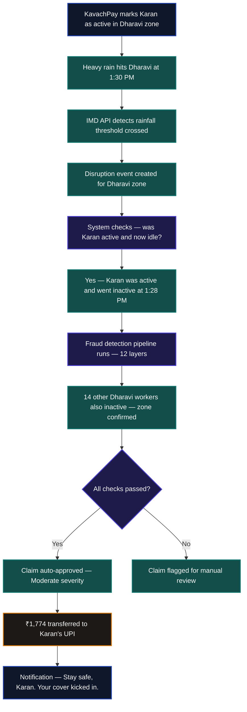
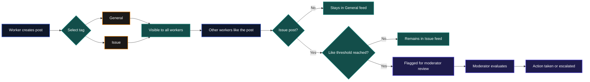
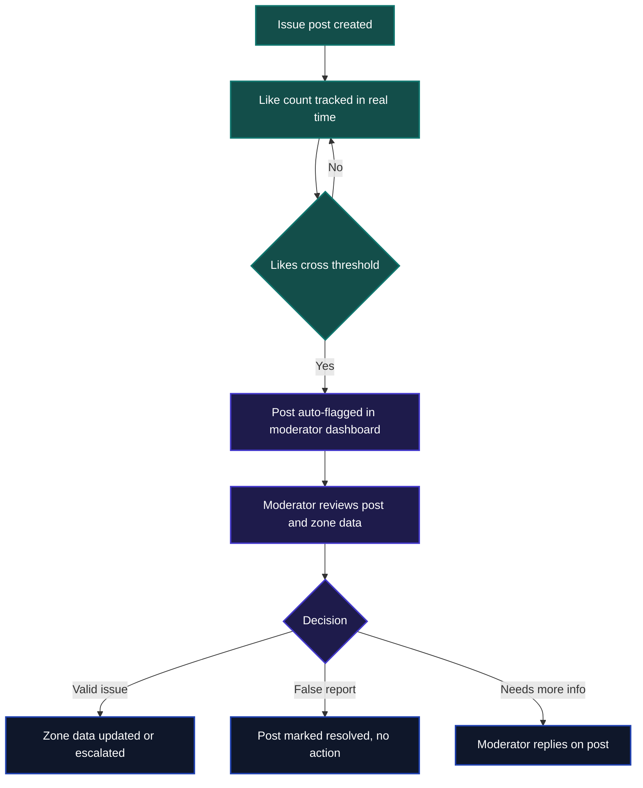

# 🛡️ KavachPay

> **Trigger. Verify. Pay.**
> Automatic income protection for food delivery workers — when the weather stops them working, KavachPay pays them instantly.

Guidewire DEVTrails 2026 | Team : The boys

**Team**
- R S Kirithic
- Madhav S
- Ankith U Davey
- Ashwin S

---

## 💡 What is KavachPay?

KavachPay is a parametric income insurance platform built for Zomato and Swiggy delivery partners in Indian metro cities. It watches for weather and environmental disruptions in a worker's delivery zone, verifies they were active and got affected, and transfers money to their UPI account automatically.

No claim form. No phone call. No waiting.

The entire flow — detection, verification, payout — happens without the worker doing anything after their morning check-in.

---

## 👤 Example — A day in the life of a KavachPay worker

<details>
<summary>📋 Worker profile — Karan Mehta</summary>

| Field | Details |
|---|---|
| **Name** | Karan Mehta |
| **Age** | 24 |
| **City** | Mumbai |
| **Zone** | Dharavi |
| **Platform** | Swiggy |
| **Months active** | 11 months |
| **Avg weekly income** | ₹4,200 |
| **Usual working days** | Mon, Tue, Wed, Thu, Fri, Sat |
| **KavachScore** | 810 — Green tier |
| **Past claims** | 3 — all verified legitimate |
| **Weekly premium** | ₹68 |
| **Weekly coverage** | ₹2,730 |
| **Referral** | Joined via referral — received one-time discount at signup |

</details>

It is a Wednesday morning in July. Karan heads out for his shift in Dharavi. By 1:30 PM, heavy rain begins battering the zone. Orders dry up, roads flood, and Karan pulls over. He has earned ₹610 so far — less than half of what a normal Wednesday brings him.

Here is what happens next.



Karan filed nothing. He made no call. By 1:52 PM — twenty-two minutes after the rain started — ₹1,774 was in his account. His KavachScore remains Green, his premium does not change, and he is covered again the following week for the same ₹68.

---

## ⚡ How It Works

**Step 1 — System monitors conditions**
Every 30 minutes, KavachPay polls live weather and AQI data for each active delivery zone. The moment a threshold is crossed, a disruption event is created for that zone.

**Step 2 — Activity is verified**
For each worker in the affected zone, the system checks if they were active and have since gone idle — consistent with being disrupted mid-shift.

**Step 3 — Fraud checks run automatically**
Twelve independent checks run in sequence: work intent, historical work patterns, zone-wide correlation, self-declaration, and KavachScore evaluation — all automated, all instant.

**Step 4 — Payout fires**
Workers who pass all checks receive a UPI transfer within minutes. The amount depends on disruption severity. No human reviews it. No approval queue.

---

## 💬 Discussion Forums

KavachPay includes a lightweight community forum where delivery workers can post, communicate, and flag issues. Posts are tagged as either **General** (open discussion about gig work, zones, and platform updates) or **Issue** (specific problems like incorrect zone ratings or payment failures). Workers can like posts, and issue posts that cross a certain like threshold are automatically surfaced to moderators for manual review — turning individual complaints into collective evidence.

The automated system can only detect what APIs can measure — discussion forums fill the gap by letting workers report ground-level problems that no weather feed will ever catch, like a misclassified zone or a silent payment failure affecting an entire area. It also builds trust with workers by giving them a visible voice in the platform, which directly improves retention and honest engagement with the KavachScore system.

### Forum flow



### Moderation logic



---

## 🤖 ML Models

### Premium Calculator

| Factor | Description |
|---|---|
| 1 · Zone risk | Flood and disruption history of delivery zone |
| 2 · Past claims | Total number of claims filed over tenure |
| 3 · Tenure | How long the worker has been on the platform |
| 4 · City tier | Metro vs smaller city — affects baseline risk |
| 5 · Age | Worker age as a proxy for riding experience |
| 6 · Claim honesty | Ratio of verified legitimate claims to total |
| 7 · Social disruption exposure | Zone's history of curfews and local strikes |
| 8 · Daily distance | Average km ridden per shift — exposure proxy |
| 9 · KavachScore | Worker's overall trust and reliability score |
| 10 · Coverage ratio | Payout ceiling as a share of weekly income |
| 11 · Voluntary top-up | Worker opts for higher premium for more cover |
| 12 · Referral discount | One-time reduction for joining via referral |

Factors 1–9 are inputs to the ML model. Factors 10–12 are applied after the model output.

---

### Fraud Detection

| Layer | Description |
|---|---|
| L1 · Work intent | Did the worker check in before the disruption? |
| L2 · Activity check | Was the worker actually idle during the event? |
| L3 · Zone correlation | Are other workers in the same zone affected? |
| L4 · Self declaration | Worker confirms impact via in-app prompt |
| L5 · KavachScore gate | Low trust score triggers manual review |
| L6A · Claim frequency | Claims per month compared to platform average |
| L6B · Honesty ratio | Share of past claims that were verified genuine |
| L7 · Severity consistency | Claimed severity matches zone-level evidence |
| L8 · Submission timing | Claim filed within valid window of disruption |
| L9 · Duplicate claim | Same claim type not already filed that day |
| L10 · Weather verification | Live API confirms the disruption actually occurred |
| L11 · Payout consistency | Claimed amount does not exceed weekly income |
| L12 · New worker high claim | Very new workers filing severe claims flagged |

---

## 🌧️ Disruption Triggers

<details>
<summary>View all 13 disruption types</summary>

- Heavy rain
- Moderate rain
- Light rain
- Severe AQI
- Moderate AQI
- Storm
- Flood
- Curfew
- Earthquake
- Landslide
- Heatwave
- Dense fog
- High wind

</details>

---

## 💰 Weekly Pricing

KavachPay charges a weekly premium because that is how delivery workers think about money. A ₹49 deduction on Monday feels manageable. A ₹200 monthly charge feels like a risk.

The base premium is ₹49 per week. It adjusts based on three factors: the flood risk profile of the worker's zone, their claim history, and how long they have been on the platform. New workers in high-risk zones pay up to ₹80 per week. Experienced workers in safer zones pay the base rate.

Coverage is always 65% of the worker's average weekly income — calculated from their signup data and adjusted over time.

Crucially, a legitimate claim never raises a worker's premium. Pricing reflects where you work, not whether you've claimed before.

---

## 🏅 KavachScore

Every worker on KavachPay has a KavachScore — a number between 300 and 900 that reflects their claim reliability. Think of it as a trust rating for insurance.

It starts at 750 for everyone. It goes up when claims are verified clean, when workers honestly decline payouts they don't need, or when they renew their policy without gaps. It goes down when fraud flags are raised.

The score determines payout speed:

- **750 and above** — transfer fires instantly
- **500 to 749** — transfer delayed by 2 hours
- **Below 500** — flagged for manual admin review

A higher KavachScore also unlocks lower premiums over time, giving workers a real incentive to engage honestly with the system.

---

## 🏗️ Architecture


---

## 📁 Repo Structure

```
kavachpay/
├── frontend/     →  React app, worker UI, dashboard
├── backend/      →  Flask API, trigger engine, claim logic
├── ml/           →  Premium calculator, fraud checks, KavachScore
├── docs/         →  Architecture diagram, research notes
└── README.md
```

---

## 🗓️ Project Timeline

**Weeks 1–2 (March 4–20)** — Research, system design, premium model, KavachScore concept, fraud system logic, repo setup, UI wireframes.

**Weeks 3–4 (March 21 – April 4)** — Core build: onboarding, backend, Firebase, weather trigger engine, end-to-end Trigger → Verify → Pay loop.

**Weeks 5–6 (April 5–17)** — Fraud detection, Razorpay payouts, worker and admin dashboards, demo video, pitch deck.

---

## 🌍 Why KavachPay Matters

India has over 12 million gig delivery workers. None of them have income insurance designed for how they actually work. KavachPay is not a modified version of an existing product — it is built ground-up for the weekly, weather-exposed, paperwork-allergic reality of the gig worker.

The goal is simple: when something outside their control stops them from earning, they should not have to fight to get compensated. They should just get paid.

---

**🎥 Video:** *(link)*
