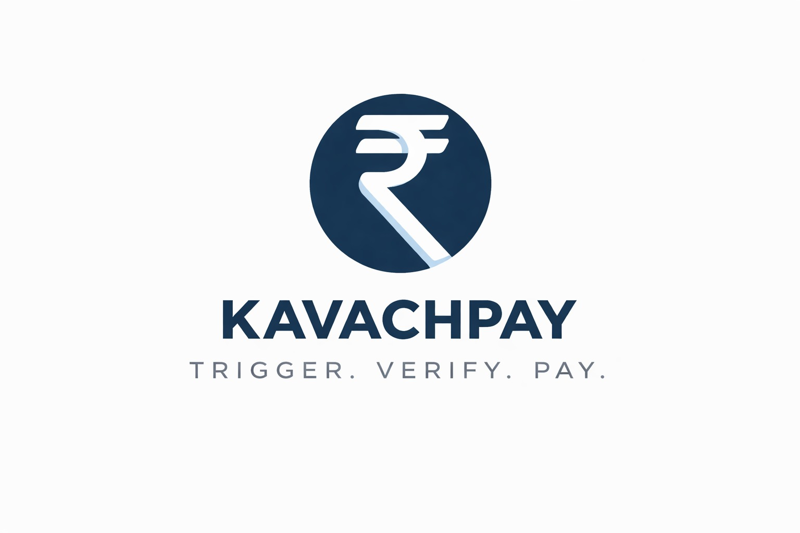
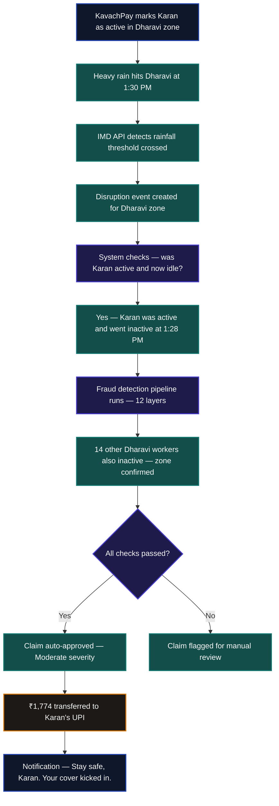
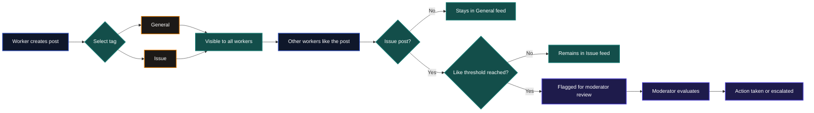
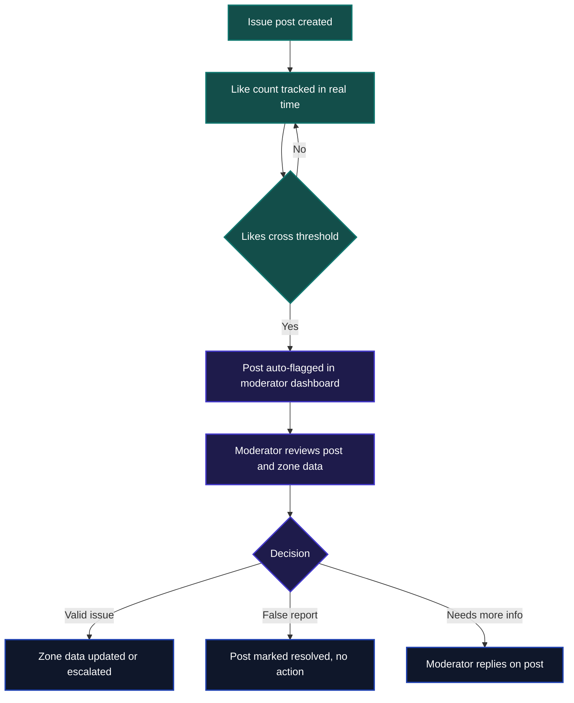
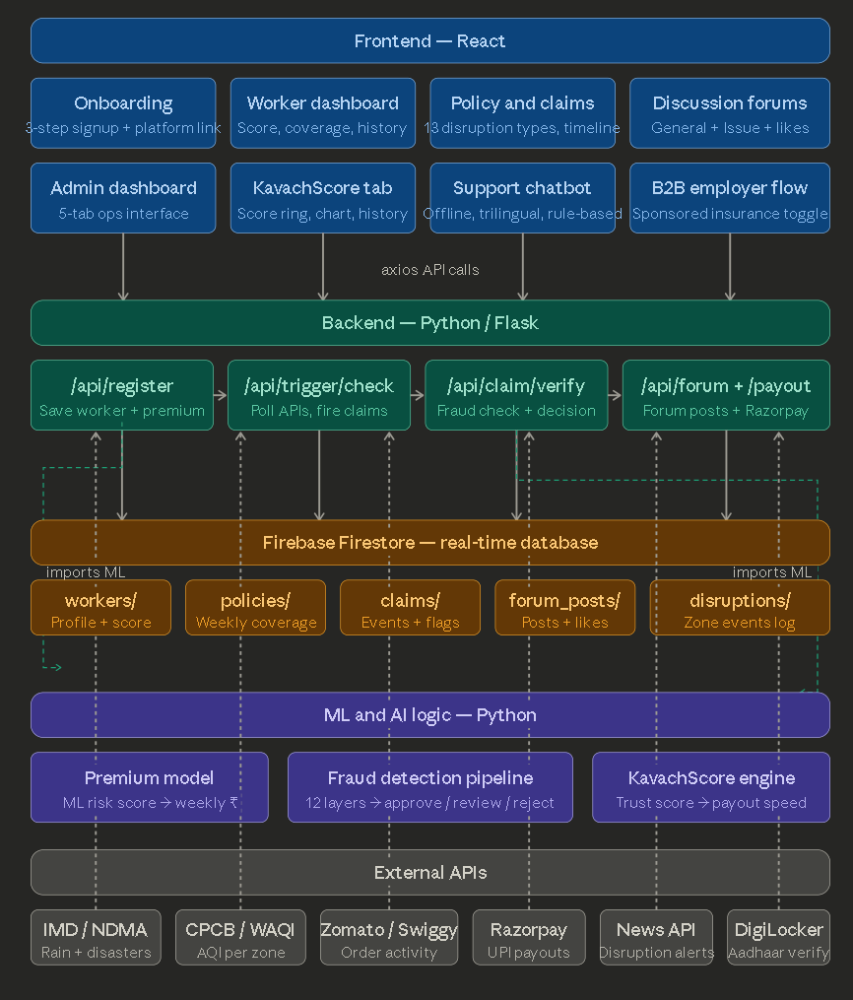

> Automatic income protection for food delivery workers — when the weather stops them working, KavachPay pays them instantly.

Guidewire DEVTrails 2026 | Team : The boys

**Team**
- R S Kirithic
- Madhav S
- Ankith U Davey
- Ashwin S

---

## 💡 What is KavachPay?

KavachPay is a parametric income insurance platform built exclusively for Zomato and Swiggy delivery partners in Indian metro cities. It monitors weather and environmental disruptions in a worker's delivery zone in real time, verifies they were actively working and got affected, and transfers money directly to their UPI account — automatically, within minutes.

No claim form. No phone call. No waiting.

The entire flow — detection, verification, payout — runs without the worker lifting a finger. When rain stops them from delivering, KavachPay pays them before they even get home.

The platform is built around a weekly premium model starting at ₹49/week, a 12-layer fraud detection pipeline, and KavachScore — a proprietary trust metric that governs payout speed and premium rates for every worker.

### 🌟 What makes KavachPay different

Most parametric insurance platforms stop at automation. KavachPay goes further.

We recognised early that no API can catch everything — a zone misclassified as safe, a payment gateway silently failing for an entire area, a local flood that hasn't made it into any government feed yet. These are real problems that real workers face, and automated systems will always miss them.

That is why KavachPay ships with a built-in **Discussion Forum** — a community layer where workers can post, flag issues, and surface ground-level problems that data feeds cannot see. Issue posts that receive enough likes from other workers are automatically escalated to moderators for review. Individual complaints become collective evidence. Worker voices become platform intelligence.

This is not a bolt-on feature. It is a core part of how KavachPay stays accurate, trusted, and honest over time.
---

## 👥 Who We Are Building For

India's food delivery workforce is one of the most financially vulnerable groups in the country. These are not casual workers — they are full-time earners who have built their livelihoods around platforms like Zomato and Swiggy, with no safety net when things go wrong.

| | |
|---|---|
| 🎂 **Age range** | 18 – 35 years |
| 🏙️ **Cities** | Bengaluru, Mumbai, Delhi, Chennai, Hyderabad |
| 💸 **Weekly income** | ₹2,500 – ₹6,000 |
| 📅 **Work pattern** | 6 to 10 hours a day, 5 to 7 days a week |
| 📱 **Device** | Android smartphone, comfortable with UPI and app-based payments |
| 🛡️ **Existing insurance** | None — completely excluded from formal products |

### The reality they face

Every monsoon season, a delivery worker loses multiple full working days to rain. Every AQI spike costs them hours they cannot recover. Every sudden curfew wipes out a day's earnings with zero warning. Traditional insurance products offer no help here — they require monthly premiums, lengthy claim paperwork, and proof of loss that a gig worker simply cannot produce.

KavachPay is built specifically around how these workers actually earn and live — weekly income cycles, daily outdoor exposure, and zero tolerance for bureaucracy.

### 👤 Example — A day in the life of a KavachPay worker

<details>
<summary>📋 Worker profile — Karan Mehta (CLICK HERE)</summary>

| Field | Details |
|---|---|
| **Name** | Karan Mehta |
| **Age** | 24 |
| **City** | Mumbai |
| **Zone** | Dharavi |
| **Platform** | Swiggy |
| **Months active** | 11 months |
| **Avg weekly income** | ₹4,200 |
| **Usual working days** | Mon, Tue, Wed, Thu, Fri, Sat |
| **KavachScore** | 810 — Green tier |
| **Past claims** | 3 — all verified legitimate |
| **Weekly premium** | ₹68 |
| **Weekly coverage** | ₹2,730 |
| **Referral** | Joined via referral — received one-time discount at signup |

</details>

It is a Wednesday morning in July. Karan heads out for his shift in Dharavi. By 1:30 PM, heavy rain begins battering the zone. Orders dry up, roads flood, and Karan pulls over. He has earned ₹610 so far — less than half of what a normal Wednesday brings him.

Here is what happens next.


Karan filed nothing. He made no call. By 1:52 PM — twenty-two minutes after the rain started — ₹1,774 was in his account. His KavachScore remains Green, his premium does not change, and he is covered again the following week for the same ₹68.
---

## ⚡ How It Works

**Step 1 — System monitors conditions**
Every 30 minutes, KavachPay polls live weather and AQI data for each active delivery zone. The moment a threshold is crossed, a disruption event is created for that zone.

**Step 2 — Activity is verified**
For each worker in the affected zone, the system checks if they were active and have since gone idle — consistent with being disrupted mid-shift.

**Step 3 — Fraud checks run automatically**
Twelve independent checks run in sequence: work intent, historical work patterns, zone-wide correlation, self-declaration, and KavachScore evaluation — all automated, all instant.

**Step 4 — Payout fires**
Workers who pass all checks receive a UPI transfer within minutes. The amount depends on disruption severity. No human reviews it. No approval queue.

---

## ⭐ Discussion Forums ⭐

KavachPay includes a lightweight community forum where delivery workers can post, communicate, and flag issues. Posts are tagged as either **General** (open discussion about gig work, zones, and platform updates) or **Issue** (specific problems like incorrect zone ratings or payment failures). Workers can like posts, and issue posts that cross a certain like threshold are automatically surfaced to moderators for manual review — turning individual complaints into collective evidence.

The automated system can only detect what APIs can measure — discussion forums fill the gap by letting workers report ground-level problems that no weather feed will ever catch, like a misclassified zone or a silent payment failure affecting an entire area. It also builds trust with workers by giving them a visible voice in the platform, which directly improves retention and honest engagement with the KavachScore system.

### Forum flow



### Moderation logic


---

## 🌧️ Disruption Triggers

- Heavy rain
- Moderate rain
- Light rain
- Severe AQI
- Moderate AQI
- Storm
- Flood
- Curfew
- Earthquake
- Landslide
- Heatwave
- Dense fog
- High wind
---

## 💰 Weekly Pricing

KavachPay charges a weekly premium because that is how delivery workers think about money. A ₹49 deduction on Monday feels manageable. A ₹200 monthly charge feels like a risk.

The base premium is ₹49 per week. It adjusts based on three factors: the flood risk profile of the worker's zone, their claim history, and how long they have been on the platform. New workers in high-risk zones pay up to ₹80 per week. Experienced workers in safer zones pay the base rate.

Coverage is always 65% of the worker's average weekly income — calculated from their signup data and adjusted over time.

Crucially, a legitimate claim never raises a worker's premium. Pricing reflects where you work, not whether you've claimed before.

---

## 🏅 KavachScore

Every worker on KavachPay has a KavachScore — a number between 300 and 900 that reflects their claim reliability. Think of it as a trust rating for insurance.

It starts at 750 for everyone. It goes up when claims are verified clean, when workers honestly decline payouts they don't need, or when they renew their policy without gaps. It goes down when fraud flags are raised.

The score determines payout speed:

- **750 and above** — transfer fires instantly
- **500 to 749** — transfer delayed by 2 hours
- **Below 500** — flagged for manual admin review

A higher KavachScore also unlocks lower premiums over time, giving workers a real incentive to engage honestly with the system.

---
## 🤖 ML Models

KavachPay uses two core ML components — a premium calculator that prices risk fairly for each worker, and a fraud detection pipeline that protects the platform from abuse without penalising honest workers.

We would be retrainning  our two ML models every 2 months 🔧

### 💰 Premium Calculator

The weekly premium is personalised to each worker using a trained ML model that weighs the following key factors:

**Models** :Random Forest regressor , XGboost regressor
| Factor | What it captures |
|---|---|
| 🗺️ Zone risk | How disruption-prone the worker's delivery area is |
| 📋 Past claims | Whether the worker has a high or low claim history |
| ⏳ Tenure | How long they have been active on the platform |
| 🏅 KavachScore | Their overall trust and reliability on the platform |
| 📍 Daily distance | How far they ride on an average shift |


### 🔍 Fraud Detection Pipeline

Every claim passes through independent verification layers before a payout is approved. No single flag blocks a claim — the system looks for patterns, not isolated anomalies.

**Models** :Randomforest classifier , Isolation forest ,Logistic regression

| Layer | What it checks |
|---|---|
| 🟢 Work intent | Was the worker active before the disruption hit? |
| 🟢 Zone correlation | Are other workers in the same zone also affected? |
| 🟡 Claim frequency | Are they claiming at an unusual rate compared to peers? |
| 🔴 Weather verification | Does live API data confirm the disruption occurred? |
| 🔴 Payout consistency | Is the claimed amount realistic given their income? |
---
## 🏗️ Architecture



---
## 🛠️ Tech Stack

| Layer | Technology | Purpose |
|---|---|---|
| 🎨 **Frontend** | React | Worker app, dashboard, admin interface |
| 🎨 **Styling** | Tailwind CSS | UI components and responsive design |
| ⚙️ **Backend** | Python / Flask | API routes, trigger engine, business logic |
| 🗄️ **Database** | Firebase Firestore | Real-time data, worker profiles, claims |
| 🤖 **ML / AI** | Python (scikit-learn) | Premium calculator, fraud detection, KavachScore |
| 🌦️ **Weather** | IMD API | Live rainfall, temperature, storm alerts |
| 🌫️ **Air Quality** | CPCB / WAQI API | Live AQI monitoring per city zone |
| 🌊 **Disasters** | NDMA API | Flood and natural disaster alerts |
| 🛵 **Platform** | Zomato / Swiggy API | Worker order activity and zone placement |
| 📰 **News** | News API | Ground-level disruption and civic event alerts |
| 💳 **Payments** | Razorpay (test mode) | Simulated UPI payouts to workers |
| 🪪 **Verification** | DigiLocker | Aadhaar verification at onboarding |
| ☁️ **Hosting** | Vercel + Render | Frontend and backend deployment |
---

## 🛡️ Adversarial Defense and Anti-Spoofing Strategy

> A syndicate of 500 workers in a tier-1 city exploited a beta parametric platform using GPS-spoofing apps — faking their locations into red-alert weather zones and draining the liquidity pool. KavachPay was built with this exact threat in mind.


### 🎯 The Differentiation — How We Separate Real Workers from Bad Actors

KavachPay does not use GPS coordinates to determine a worker's zone. Instead, **zone placement is derived entirely from the worker's 5 most recent pickup and delivery locations pulled from the Zomato / Swiggy platform API.**

This is the core of our anti-spoofing architecture. A worker's "location" in our system is not where their phone says they are — it is where their last 5 orders were actually fulfilled.
```
Zone assignment = median location cluster of last 5 pickup + delivery points
```

This single architectural decision makes GPS spoofing **completely irrelevant** to KavachPay. A bad actor can fake their GPS to show they are in Dharavi — but unless they physically completed 5 real orders in Dharavi, our system will not place them there.


### 📊 The Data — What We Analyse Beyond GPS

To detect coordinated fraud rings, KavachPay cross-references the following signals on every claim:

| Signal | What it catches |
|---|---|
| 🗺️ **Last 5 pickup + drop locations** | Zone spoofing — GPS means nothing if order history says otherwise |
| 👥 **Zone claim density spike** | Sudden mass claims from one zone in a short window — syndicate pattern |
| ⏱️ **Time between last order and claim** | Legitimate workers go idle mid-shift — fraudsters never started |
| 📱 **Platform API order activity** | No orders accepted that day = no proof of intent to work |
| 🔁 **Claim coordination timing** | Multiple workers claiming within minutes of each other — statistically abnormal |
| 📉 **KavachScore history** | New accounts with no delivery history filing severe claims immediately |
| 🏘️ **Order location vs claimed zone** | Last 5 orders in Zone A but claiming disruption in Zone B — flagged instantly |

The 5-order threshold is deliberately chosen. Completing 5 real pickups and drops in a fake zone just to qualify for a claim is operationally infeasible for a fraud syndicate at scale — the cost of the deception exceeds the payout.

### ⚖️ The UX Balance — Protecting Honest Workers

A worker experiencing a genuine network drop during a storm should never be penalised for it. KavachPay's flagging system is designed with this explicitly in mind.

**How flagged claims are handled:**
```
Single flag raised
        ↓
Claim enters soft-hold (not rejected)
        ↓
System waits 2 hours for corroborating zone data
        ↓
If 3+ other workers in same zone also claimed → auto-approved
If isolated → escalated to manual review with full context
```

**Key protections for honest workers:**

- 🟢 **A network drop does not raise a flag.** Connectivity issues are expected in heavy rain. The system only checks order history, not real-time GPS pings.
- 🟡 **A single flag never auto-rejects.** It triggers a soft-hold and a secondary check — not an immediate denial.
- 🔵 **Zone is locked to order history, not live location.** A worker who loses signal mid-shift is not moved out of their zone. Their last 5 orders anchor them there permanently for that claim window.
- 🏅 **KavachScore absorbs uncertainty fairly.** Workers with high scores (750+) get the benefit of the doubt on ambiguous flags. Their track record speaks for them.
- 📞 **Manual review includes worker context.** Reviewers see the full picture — order history, zone data, weather API confirmation — not just a flag count.

### 🧠 Why This Architecture is Syndicate-Resistant

A GPS spoofing syndicate works because it is cheap, fast, and scalable. One person can spoof their location in seconds. Our defence breaks this economics entirely.

To successfully defraud KavachPay, a bad actor would need to:

1. Physically travel to a target disruption zone
2. Complete 5 real Zomato / Swiggy orders in that zone
3. Then go idle and file a claim

At that point — they were genuinely working in a disrupted zone. **That is not fraud. That is exactly who KavachPay is built to protect.**

The system is not just resistant to GPS spoofing. It is structurally immune to it.


## 📁 Repo Structure

```
kavachpay/
├── frontend/     →  React app, worker UI, dashboard
├── backend/      →  Flask API, trigger engine, claim logic
├── ml/           →  Premium calculator, fraud checks, KavachScore
├── docs/         →  Architecture diagram, research notes
└── README.md
```

---

## 🗓️ Project Timeline

**Weeks 1–2 (March 4–20)** — Research, system design, premium model, KavachScore concept, fraud system logic, repo setup, UI wireframes.

**Weeks 3–4 (March 21 – April 4)** — Core build: onboarding, backend, Firebase, weather trigger engine, end-to-end Trigger → Verify → Pay loop.

**Weeks 5–6 (April 5–17)** — Fraud detection, Razorpay payouts, worker and admin dashboards, demo video, pitch deck.

---

## 🌍 Why KavachPay Matters

India has over 12 million gig delivery workers. None of them have income insurance designed for how they actually work. KavachPay is not a modified version of an existing product — it is built ground-up for the weekly, weather-exposed, paperwork-allergic reality of the gig worker.

The goal is simple: when something outside their control stops them from earning, they should not have to fight to get compensated. They should just get paid.

---

**🎥 Video:** *(link)*
